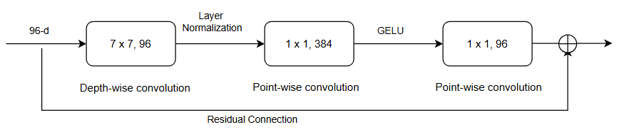
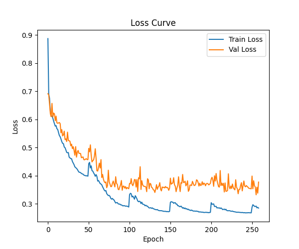
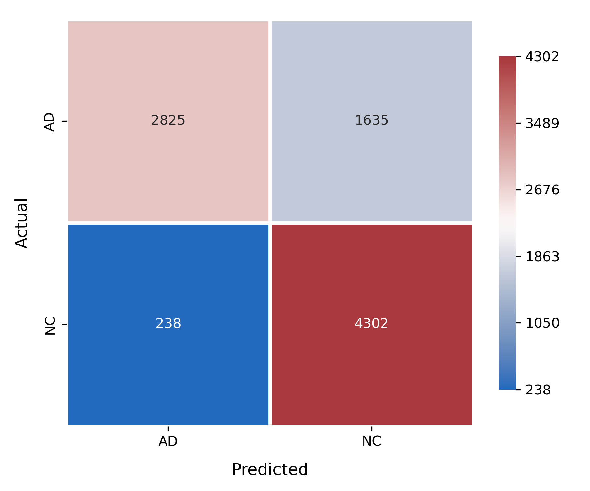
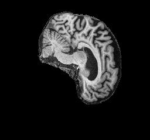
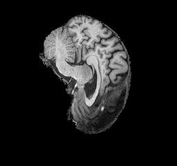
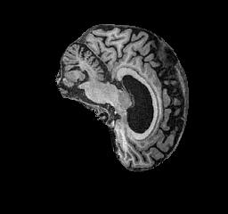

# Alzheimer's Disease Classification using ConvNeXt on the ADNI dataset

## Table of Contents

- [Goal](#Goal)
- [Model Architecture](#model-architecture)
    - [ConvNext Block Structure](#convnext_block_structure)
        - [Depthwise Convolution Layer](#depthwise-convolution-layer)
        - [Inverted Bottleneck Layer](#inverted-bottleneck-layer)
        - [Normalization Layer](#normalization-layer)
    - [Architecture](#architecture)
        - [Stage](#stage)
        - [Stem Layer](#stem-layer)
        - [Downsampling Layer](#downsampling-layer)
        - [Classifier Layer](#classifier-layer)
- [Dataset](#dataset)
    - [Overview](#overview)
    - [Data Preprocessing](#data-prepocessing)
- [Training Process](#training-process)
- [Performance and Results](#performance-and-results)
    - [Performance Metrics](#performance-metrics)
    - [Example Predictions on Test Images](#example-predictions-on-test-images)
- [Usage Instructions](#usage-instructions)
    - [Clone the Repository](#clone-the-repository)
    - [Install Dependencies](#install-dependencies)
    - [Train model](#train-model)
    - [Make Predictions on Images](#make-predictions-on-images)
- [References](#references)

## Goal

The goal of this project is to classify brain MRI images from the Alzheimer’s Disease Neuroimaging Initiative (ADNI) dataset into two categories: Alzheimer’s Disease (AD) and Normal Control (NC). Early detection of Alzheimer’s is crucial, as timely intervention can help slow cognitive decline and preserve quality of life. This project employs ConvNeXt, a modern convolutional neural network (CNN) architecture, for the binary classification task. Leveraging the original ConvNeXt design, the model achieved an accuracy of 79.19% on the ADNI test dataset.


## Model Architecture
### ConvNext Block Structure

ConvNeXt is a modern convolutional neural network architecture that builds on the strengths of traditional CNNs while incorporating design principles inspired by Vision Transformers. Overall, it achieves transformer-level performance on vision tasks while retaining the efficiency and simplicity of convolutional networks [[1]](#convnext). A ConvNeXt block consists of a large kernel depthwise convolution, layer normalization, pointwise convolution, followed by layer scaling and a resdidual/skip connection with stochastic depth.
#### Depthwise convolution Layer
In each ConvNeXt block, a depthwise convolution is applied where each input channel is convolved separately with its own filter (groups = number of channels). This preserves the number of channels while allowing spatial feature extraction independently per channel. Depthwise convolution reduces computational cost compared to standard convolution while maintaining the ability to capture spatial patterns in feature maps.

#### Inverted Bottleneck Layer
Each ConvNeXt block adopts an inverted bottleneck design, where the feature channels are first expanded by 4× using a 1×1 convolution, followed by a SiLu activation, and then projected back to the original dimension with another 1×1 convolution. This structure allows more computation and non-linearity in a higher-dimensional space, improving feature representation without significantly increasing computational cost.

#### Normalization Layer
Instead of Batch Normalization in ResNet-50, ConvNeXt adopts Layer Normalization which is more stable across different batch sizes.


<a id="convnext-block" src="convnext_block.png"></a>

Figure 1. ConvNeXt Block Structure

### Architecture
The network is organized into stages, with stem layer at first and downsampling layers in between to progressively reduce spatial resolution while increasing feature depth. Each stage includes multiple residual blocks learning the feature at the corresponding resolution.

#### Stage

ConvNext has 4 stages and the number of blocks each stage are as follow (3, 3, 9, 3).

#### Stem Layer
A simple stem layer with a non-overlapping 4×4 convolution is used to downsample the input images, following the design principle of the Vision Transformer for early spatial reduction.

#### Downsampling Layer
ConvNeXt employs separate 2×2 convolutional layers with stride 2 between stages to downsample feature maps, reducing spatial resolution while increasing channel depth.

#### Classifier Layer
The ConvNeXt architecture ends with a Global Average Pooling layer followed by Layer Normalization and a Dropout layer before the final Fully Connected (FC) layer. These additions improve regularization and enhance training stability, particularly on smaller datasets. <br/><br/>The image below demonstrates the model being used in this project. 


<a id="convnext-structure"></a>

Figure 2. ConvNeXt architecture used in this project

## Dataset

### Overview

The ADNI dataset employed in this project contains MRI brain scans labeled as either Alzheimer’s Disease (AD) or Normal Control (NC). All images are grayscale with a resolution of 256 × 240 pixels. File names use the format `patientID_index.png` where `patientID` identifies the patient and `index` denotes the image sequence. A summary of the dataset, including the number of images and patients in both the training and testing sets, is provided in [Table 1](#adni-table).

<a id="adni-table"></a>

| Dataset Split  | AD Images | NC Images | Total Images | Patients  |
|----------------|-----------|-----------|--------------|-----------|
| **Train**      | 10,400    | 11,120    | 21,520       | 1,076     |
| **Test**       | 4,460     | 4,540     | 9,000        | 450       |
| **Total**      | 14,860    | 15,660    | 30,520       | 1526      |

Table 1. ADNI Data Summary Table

The dataset structure is arranged in the following hierarchy:
```
AD_NC/
├── test/
│   ├── AD/
│   └── NC/
├── train/
│   ├── AD/
│   └── NC/
```

The training set is further split into training and validation subsets based on patient IDs to avoid data leakage. Specifically, 10% of the patients are assigned to the validation set, while the remaining 90% are used for training, ensuring each patient appears in only one subset. The test set remains unchanged and is used as provided.
### Data Prepocessing

To enhance model's generalization and prevent overfitting, various data augmentation techniques are used:

- Resized to 224 x 224 pixels

- Converted to 1 channel

- Normalized using specific mean and standard deviation for each dataset.

- Horizontal Flipping: randomly flips the MRI image left to right, helping the model learn orientation-invariant features.

- Random Rotation (10): Rotates images randomly within ±10 degrees, simulating slight variations in patient positioning.

- Color Jittering: Slightly adjusts brightness and contrast to mimic differences in MRI acquisition conditions.

- Random Affine Transformation (0.05): Applies small random translations (up to 5% of image size), improving robustness to minor shifts in brain location.

- Random Adjust Sharpness: randomly adjusts the sharpness of an image, used to make your model more robust to variations in image clarity or focus.


## Training Process

The model was trained for 260 epochs with early stopping based on validation loss to prevent overfitting. To improve generalization, the training employed the AdamW optimizer with weight decay, along with Drop Path (stochastic depth) and Dropout. Cross-entropy loss with label smoothing was used as the objective function for this classification task.

The main hyperparameters used in the training process are summarized in [Table 2](#hyperparameters)

<a id="hyperparameters"></a>

| **Hyperparameter**            | **Value**                             |
| ------------------------------| --------------------------------------|
| Optimizer                     | AdamW                                 |
| Learning Rate                 | 5e-4                                  |
| Learning Rate Scheduler       | CosineAnnealingLRWarmRestarts         |
| Weight Decay                  | 1e-4                                  |
| Batch Size                    | 256                                   |
| Epochs                        | 260                                   |
| Early Stopping Patience       | 50                                    |
| Drop Path Rate                | 0.3                                   |
| Layer Scale                   | 1e-6                                  |
| Label Smoothing               | 0.15                                  |
| Loss Function                 | CrossEntropyLoss                      |

Table 2. Summary of hyperparameters and training configuration.

## Performance and Results

### Performance metrics
The model was trained for 260 epochs, with the best-performing model selected at the 240th epoch, corresponding to the lowest validation loss. The training and validation loss curves are shown below. As observed, the training loss dips slightly below the validation loss, suggesting a minor degree of overfitting.



Figure 3. Loss curve of train and validation set.

The model achieved an overall accuracy of 79.19% on test dataset, with a precision of 0.82, recall of 0.79, and an F1-score of 0.79. The confusion matrix below summarizes the results on the test set. As observed, the model performs well overall, but it still struggles to distinguish some actual AD cases from Normal Control, resulting in a number of false negatives.



Figure 4. Confusion  Matrix


### Example Predictions on Test Images
| Image                                | True Label | Predicted Label | Confidence | 
| ------------------------------------ | ---------- | --------------- | ---------- | 
|        | AD         | AD              | 0.93       | 
|        | AD         | AD              | 0.82       | 
|        | NC         | NC              | 0.93       | 
|        | NC         | NC              | 0.92       | 


## Usage Instructions

### Clone the Repository
You can clone the project by entering those commands as following in terminal: 
```
git clone https://github.com/zzkhangg/PatternAnalysis-2025.git
cd ./recognition/ConvNeXt-s4906401
```

### Install dependencies
To install project's dependencies in order to train and make predictions, enter the following command:<br>
`pip install -r requirements.txt`

### Training model
To start training the model, enter the following command:<br>
`python train.py`<br>
If your dataset is in another directory than the `BASE_PATH` decfined in `train.py`, you can config the `BASE_PATH` to your dataset directory. Ensuring the dataset (train and test) has separate AD and NC as subfolders.
You can also cofigurate your own desired hyperparamters in `train.py`.
### Make Predictions on Images
After training your own model, you can load that model and make predictions on images as using command as follow:<br/>
`python predict.py [--input_path PATH_TO_IMAGE/DIR] [--model_path PATH]`<br>
You can use the model to classify images as either AD or NC. If the provided path is a directory, the model will predict and display results for each image within it. If the path points to a single image, the model will output the predicted class along with its probability. Optionally, you can specify a custom model path; otherwise, the script will use the `DEFAULT_MODEL_PATH` as defined in `predict.py`
## References
<a id="convnext"></a>[1] Liu, Z., Mao, H., Wu, C. Y., Feichtenhofer, C., Darrell, T., & Xie, S. (2022). *A ConvNet for the 2020s*. In CVPR. [https://arxiv.org/abs/2201.03545](https://arxiv.org/abs/2201.03545)


