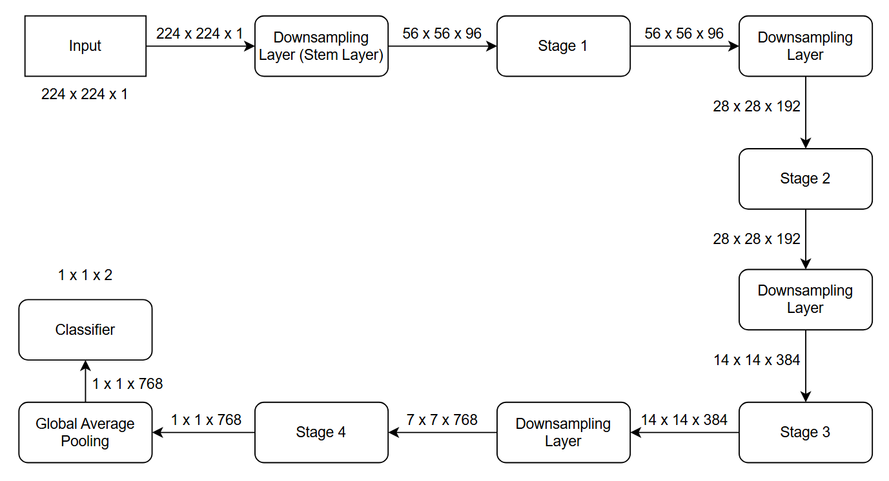

# Alzheimer's Disease Classification using ConvNeXt on the ADNI dataset

## Table of Contents

- [Overview](#overview)
- [Model Architecture](#model-architecture)
    - [Stage Compute Ratio](#stage-compute-ratio)
    - [Patchify Stem](#patchify-stem)
    - [ResNeXt Design Employment](#resnext-design-employment)
    - [Inverted Bottleneck](#inverted-bottleneck)
    - [Activation Functions](#activation-functions)
    - [Normalization Layer](#normalization-layer)
    - [Downsampling Layer](#downsampling-layer)
- [Dataset Description](#dataset-description)
    - [Overview](#overview-1)
    - [Preprocessing](#prepocessing)
    - [Datasplit](#datasplit)
- [Training Process](#training-process)
- [Results](#results)
    - [Performance Metrics](#performance-metrics)
    - [Example Predictions](#example-predictions)
- [Usage](#usage)
    - [Clone the Repository](#clone-the-repository)
    - [Install Dependencies](#install-dependencies)
    - [Directory Structure](#directory-structure)
    - [Adjust Hyperparameters](#adjust-hyperparameters)
    - [Train the Model](#train-the-model)
    - [Run Predictions on New Images](#run-predictions-on-new-images)
- [References](#references)

## Overview

This project goal is to classify between Alzheimer's disease (AD) and Normal Control (CN) on Alzheimer's disease Neuroimaging Initiative (ADNI). Identifying Alzheimer early allows interventions to begin before significant brain damage occurs, potentially slowing cognitive decline and preserving quality of life. ConvNeXt, a modern vision model utilizing Convolution Neural Network, is used in this project in this binary classification problem. Leveraging on original ConvNeXt architecture, the model reachded 79.38% accuracy on the ADNI test dataset.

## Model Architecture
ConvNeXt is a modern convolutional neural network architecture that builds on the strengths of traditional CNNs while incorporating design principles inspired by Vision Transformers. Overall, it achieves transformer-level performance on vision tasks while retaining the efficiency and simplicity of convolutional networks. A ConvNeXt block consists of a large kernel depthwise convolution, layer normalization, pointwise convolution, followed by layer scaling and a resdidual/skip connection with stochastic depth. 

Figure 1. ConvNeXt Block 

The network is organized into stages, with stem layer at first and downsampling layers in between to progressively reduce spatial resolution while increasing feature depth. Each stage includes multiple residual blocks learning the feature at the corresponding resolution.  The image below demonstrates the model being used in this project. 

Figure 2. ConvNeXt architecture

### Stage Compute Ratio

ConvNext has 4 stages and the number of blocks each stage is changed from (3, 4, 6, 3) in ResNet-50 to (3, 3, 9, 3).

### Stem/ "Patchify" Layer

A simple "Patchify" stem (4 x 4 non-overlapping convolution) are used in this model to downsample input images to mimic the design of Vision Transformer to downsample the input images.

### Inverted Bottleneck Layer
Each ConvNeXt block adopts an inverted bottleneck design, where the feature channels are first expanded by 4× using a 1×1 convolution, followed by a GELU activation, and then projected back to the original dimension with another 1×1 convolution. This structure allows more computation and non-linearity in a higher-dimensional space, improving feature representation without significantly increasing computational cost.

### Layer Normalization
Instead of Batch Normalization in ResNet-50, ConvNeXt adopts Layer Normalization which is more stable across different batch sizes.

### Activation Function
ConvNeXt replaces the ReLU activation from ResNet-50 with the smoother GELU activation introducing non-linearity to the model.
GELU (Gaussian Error Linear Unit) provides better gradient flow and performance consistency, following modern transformer activation design.

### Downsampling Layers
ConvNeXt separates downsampling into independent 2×2 convolutional layers with stride 2 between stages to reduce spatial resolution and increase feature depth.

### Classifier Head
The ConvNeXt architecture ends with a Global Average Pooling layer followed by Layer Normalization and a Dropout layer before the final Fully Connected (FC) layer. These additions improve regularization and enhance training stability, particularly on smaller datasets.
## Dataset Description

### Overview

he ADNI dataset used in this project consists of MRI brain images categorized into two classes: Alzheimer’s Disease (AD) and Normal Control (NC). Each image is grayscale with a resolution of 256 x 240 pixels. The filenames follow the format `patientID_index.png` where `patientID` represents the patient identifier and `index` is the image number.indicates the image number. The dataset statistics, including the number of images and patients in the training and testing sets for both classes, are summarized in [Table 1](#adni-table).

| Dataset Split  | AD Images | NC Images | Total Images | Patients  |
|----------------|-----------|-----------|--------------|-----------|
| **Train**      | 10,400    | 11,120    | 21,520       | 1,076     |
| **Test**       | 4,460     | 4,540     | 9,000        | 450       |
| **Total**      | 14,860    | 15,660    | 30,520       | 1526      |

Table 1. ADNI dataset split statistics (images and patients).

### Prepocessing

All MRI images are preprocessed before training. Images are resized to 224 x 224, converted to 1 channel  and normalized using specific mean and standard deviation for each dataset. To enhance model's generalization and prevent overfitting, various data augmentation techniques are used:

- Horizontal Flipping: randomly flips the MRI image left to right, helping the model learn orientation-invariant features.

- Random Rotation (10): Rotates images randomly within ±10 degrees, simulating slight variations in patient positioning.

- Color Jittering: Slightly adjusts brightness and contrast to mimic differences in MRI acquisition conditions.

- Random Affine Transformation (0.05): Applies small random translations (up to 5% of image size), improving robustness to minor shifts in brain location.

### Datasplit

The training set is further divided into training and validation subsets based on patient ID to prevent data leakage, with 10% of patients allocated to validation and the remaining 90% used for training. Each patient appears in only one subset. The test set is used as provided, without modification.

## Training Process

The model was trained on the ADNI dataset using PyTorch framework. The model was trained for 260 epochs with early stopping based on validation loss to prevent overfitting. The AdamW optimizer was used to improve training stability and reduce overfitting through weight decay. Regularization schemes such as Label Smoothing [[7]](#label-smoothing) and Stochastic Depth [[4]](#stochastic-depth) were used to improve generalization.

The main hyperparameters used in the training process are summarized in [Table 2](#hyperparameters)

| **Hyperparameter**            | **Value**                             |
| ------------------------------| --------------------------------------|
| Optimizer                     | AdamW                                 |
| Learning Rate                 | 4e-3                                  |
| Learning Rate Scheduler       | CosineAnnealingLR                     |
| Weight Decay                  | 0.01                                  |
| Batch Size                    | 256                                   |
| Epochs                        | 450                                   |
| Early Stopping Patience       | 50                                    |
| Stochastic Depth              | 0.1                                   |
| Layer Scale                   | 1e-6                                  |
| Label Smoothing               | 0.1                                   |
| Loss Function                 | CrossEntropyLoss                      |

Table 2. Summary of hyperparameters and training configuration.

## References

